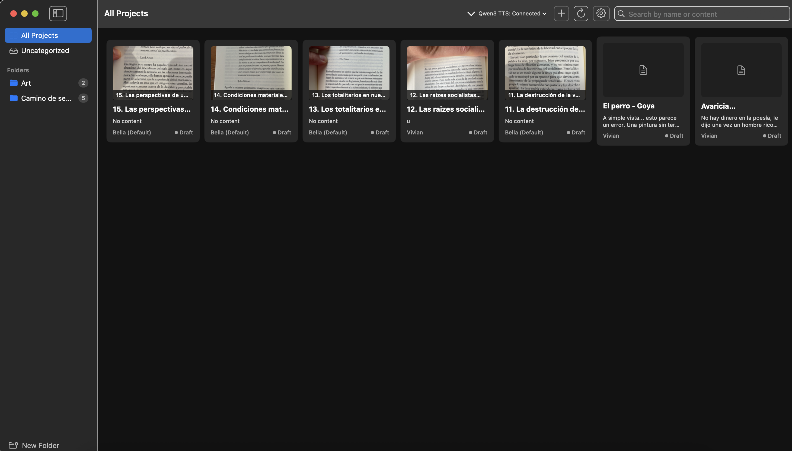
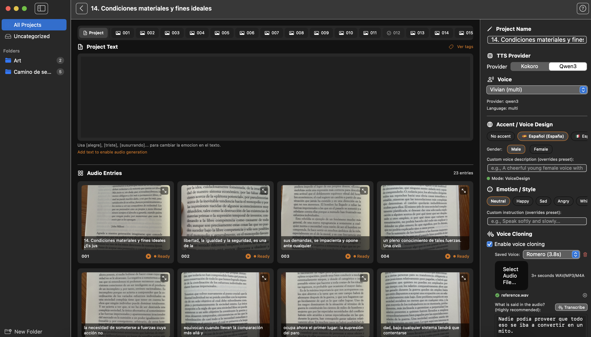

<p align="center">
  <!-- Logo: logo.png -->
  
</p>

<h1 align="center">ReaderPro</h1>

<p align="center">
  <strong>Turn any text, image, or document into natural-sounding audio — 100% locally on your Mac.</strong>
</p>

<p align="center">
  <a href="https://github.com/JasonTaverner/ReaderPro/releases"></a>
  <a href="https://github.com/JasonTaverner/ReaderPro"></a>
  <a href="LICENSE"></a>
  <a href="https://github.com/JasonTaverner/ReaderPro/stargazers"></a>
</p>

<p align="center">
  <a href="#-get-readerpro"><strong>Download</strong></a> ·
  <a href="#-features"><strong>Features</strong></a> ·
  <a href="#-quick-start-developers"><strong>Build from Source</strong></a> ·
</p>

---

<!-- Screenshot: hero-screenshot.png -->
<p align="center">
  

</p>

## Why ReaderPro?

- **Listen to anything** — Paste text, import PDFs/EPUBs, drop images, or capture your screen. ReaderPro reads it all.
- **Voices that sound human** — AI-powered voices with emotion control (happy, sad, whispering...) and voice cloning from just 3 seconds of audio.
- **Your data stays yours** — Everything runs locally on your Mac. No cloud, no subscriptions, no data leaving your machine.
- **10 languages, 40+ voices** — Spanish, English, Japanese, Korean, Chinese, French, German, Italian, Portuguese, Hindi.

---

## Get ReaderPro

<p align="center">
  <!-- TODO: Replace with real links -->
  <a href="https://gumroad.com/l/readerpro"></a>
  &nbsp;&nbsp;
  <a href="#-quick-start-developers"></a>
</p>

---

## Features

### Voice Engines

| Engine | Quality | Speed | Offline | Setup |
|:---|:---:|:---:|:---:|:---|
| **Qwen3-TTS (MLX)** | ★★★★★ | ~20 tok/s | ✅ | MLX server |
| **Kokoro ONNX** | ★★★★☆ | Fast | ✅ | Built-in |
| **Kokoro Server** | ★★★★☆ | Fast | ✅ | Local server |
| **System Voices** | ★★★☆☆ | Instant | ✅ | None |

### Core Capabilities

**🎙️ Voice Cloning**
Clone any voice with 3 seconds of reference audio. Fast mode for quick results, or full mode for maximum accuracy.

**🎭 Emotion & Style Control**
8 emotion presets — neutral, happy, sad, angry, whisper, excited, calm, fearful. Shape how your text sounds.

**🌍 10 Languages, 40+ Voices**
Spanish, English (US & UK), Japanese, Korean, Chinese, French, German, Italian, Portuguese, Hindi. Each with multiple voice options.

**📸 OCR → Audio**
Drop an image, screenshot your screen, or import a scanned PDF. ReaderPro extracts the text and reads it aloud.

**📄 PDF & EPUB Support**
Import entire documents. Text extraction with automatic OCR fallback for scanned pages.

**🔀 Project Merge**
Combine all entries in a project into a single audio file, merged text document, and image PDF.

**⚡ Apple Silicon Optimized**
Qwen3-TTS runs natively on Apple Silicon via MLX. Kokoro uses ONNX Runtime. Both are tuned for M1/M2/M3/M4.

**🔒 100% Local & Private**
No internet required. No API keys. No cloud processing. Everything runs on your Mac.

## Quick Start (Developers)

### Requirements

- **macOS 14.0+** (Sonoma or later)
- **Xcode 15.0+**
- **8 GB RAM** minimum (16 GB recommended for Qwen3-TTS voice cloning)
- Apple Silicon recommended (Intel supported, slower)

### Build & Run

```bash
git clone https://github.com/JasonTaverner/ReaderPro.git
cd ReaderPro
open ReaderPro.xcodeproj
# Press Cmd+R to build and run
```

The app works immediately with **built-in Kokoro ONNX** and **macOS system voices** — no additional setup needed.

### Optional: Enable Qwen3-TTS (Best Quality)

Qwen3-TTS gives the highest quality voices with emotion control and voice cloning. It requires a local MLX server:

```bash
# Install the Qwen3-TTS MLX server (Python 3.10+)
pip install qwen3-tts-mlx

# Start the server (runs on localhost:8890)
qwen3-tts-server
```

ReaderPro auto-detects the server and enables Qwen3 voices in the UI.

---

## Tech Stack

<p>
  
  
  
  
  
  
</p>

| Layer | Technology |
|:---|:---|
| UI | SwiftUI + Presenter pattern |
| Application | Use Cases (CQRS-lite) |
| Domain | Pure Swift — no framework imports |
| Infrastructure | SwiftData, AVFoundation, Vision, ONNX Runtime |
| TTS | Qwen3-TTS (MLX), Kokoro (ONNX + Server), AVSpeechSynthesizer |

### Architecture

Built with **Domain-Driven Design** and **Hexagonal Architecture** (Ports & Adapters). The domain layer has zero external dependencies — making it fully testable and portable.

```
UI (SwiftUI) → Application (Use Cases) → Domain (Pure Swift) ← Infrastructure (Adapters)
```

See [README_DEV.md](README_DEV.md) for the full architecture guide, project structure, and contribution workflow.

## FAQ

**Is my data sent to the cloud?**
No. All processing happens locally on your Mac. ReaderPro makes zero network requests.

**Does it work on Intel Macs?**
Yes. System voices and Kokoro ONNX work on Intel. Qwen3-TTS (MLX) requires Apple Silicon.

**Can I use it commercially?**
Yes. The GPLv3 license allows commercial use. Any modifications you distribute must also be GPLv3.

**How does voice cloning work?**
Provide 3+ seconds of reference audio and ReaderPro creates a voice profile using Qwen3-TTS. Works entirely on-device.

## License

This project is licensed under the **[GNU General Public License v3.0](LICENSE)** — you are free to use, modify, and distribute the source code under the terms of the GPLv3. Any derivative work must also be released under GPLv3.

The **Paid version** offers a pre-built app. The code is and will remain open source.

---

<p align="center">
  Made with ❤️ for readers, learners, and creators.<br><br>
  If you find ReaderPro useful, consider <a href="https://gumroad.com/l/readerpro">buying the Pro version</a> or <a href="https://github.com/JasonTaverner/ReaderPro">starring the repo ⭐</a>
</p>
